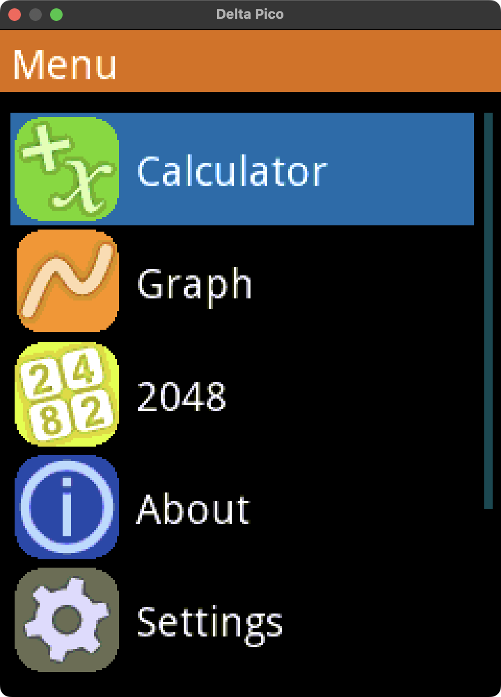

# Delta Pico Simulator

This is a desktop simulator for my [Delta Pico](https://github.com/AaronC81/delta-pico) graphing
calculator.

This works by providing an implementation of `ApplicationFramework` (the Delta Pico firmware's HAL
trait), which draws to a window backed by `minifb` and translates keystrokes into keypad buttons.

## Button Mapping

Buttons are directly mapped to their keyboard equivalents where possible (e.g. digit buttons are
mapped to the number keys). Other important keys are mapped as follows:

| Physical button | Keyboard key |
|---|---|
| EXE | Enter |
| MENU | Escape |
| SHIFT | Tab | 
| LIST | Space |

See the `BUTTON_MAPPING` constant in the source for a full list.

## Usage

1. Check out the main Delta Pico repository
2. Check out this repository
3. Adjust the `delta-pico-rust` crate path in `Cargo.toml` to match the location of the `rust`
   subfolder in your main Delta Pico checkout
4. `cargo run` in this repository

## Functionality 

Most features work fine, with these (known) exceptions:

- Storage does not persist between re-runs of the simulator
- The simulator doesn't have a bootloader
- Colours don't show up exactly the same on the simulator - what looks grey on the real thing shows
  up as a dark green on the simulator

Also, `minifb` doesn't seem to like not being updated for long periods, on macOS at least. If you
move the window between displays, you might end up with artifacts until the screen updates again.

## Why isn't this in the main repo?

Unfortunately, rust-analyzer does not seem to like mixed `std` and `no-std` targets in the same 
workspace! Including this crate in the main repository makes rust-analyzer stop working almost
completely, so I've kept it separate instead, and just open a second VS Code window for this crate.
